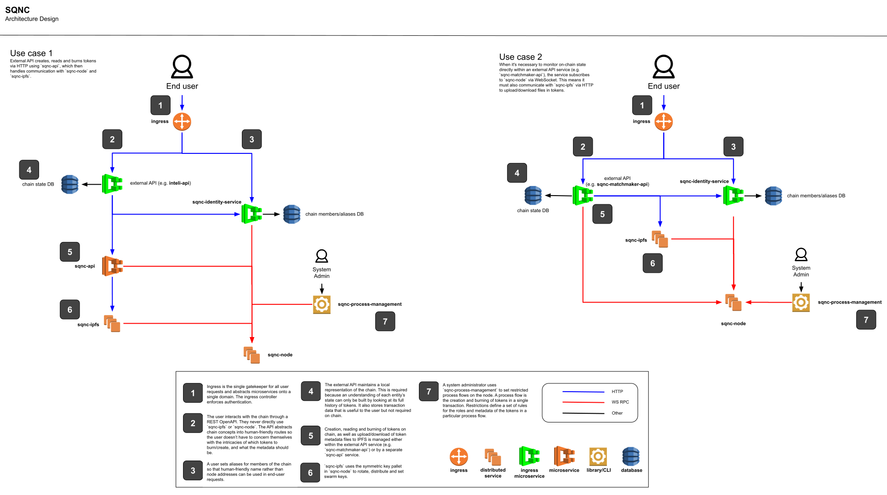

# DSCP Architecture

DSCP architecture has two variations.

- `v1` interacts with `dscp-node` and `dscp-ipfs` using `dscp-api`.
- `v2` interacts with `dscp-node` and `dscp-ipfs` within the external API service e.g. `dscp-matchmaker-api`.

See the diagram for more details

[Edit diagram](https://docs.google.com/drawings/d/1eanItroFbYsq9VPdpPe-2vMjSPNHgFpFmLiL6K_K5mM/edit)
