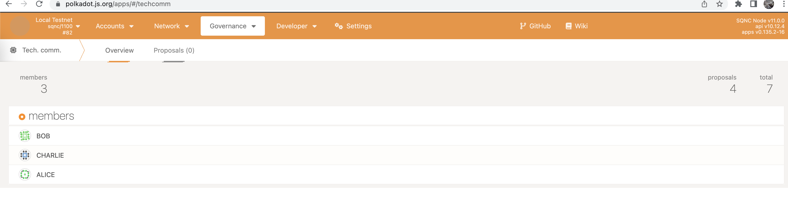
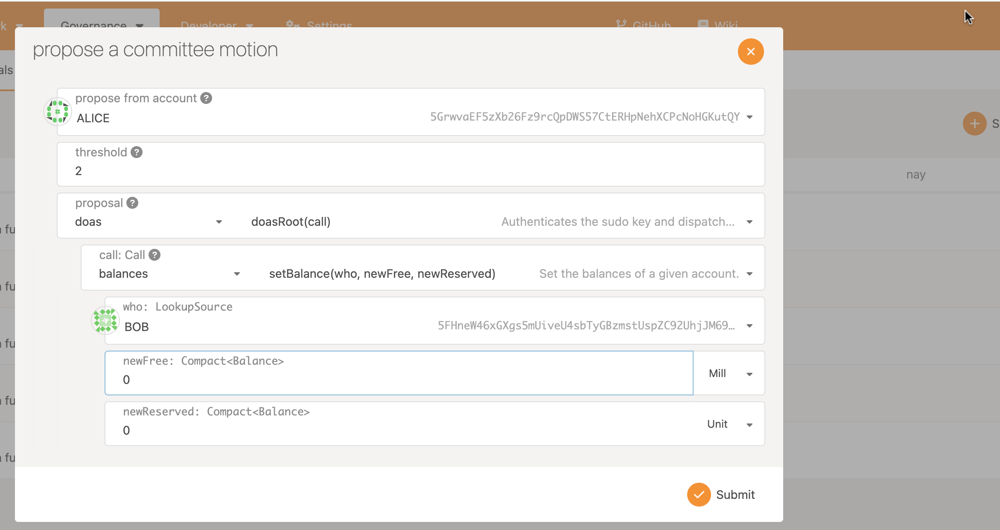

# Governance

This page describes some of the governance procedures within `sqnc-node`.

## Create a Vote

Assuming you are running a node and connected with [Polkadot JS Apps](https://polkadot.js.org/apps/) - in order to create a vote, select the `Governance` tab, then `Tech. Comm`. You will then be presented with a screen with the current Governance members.

To start a new vote select `Proposals`.

On the `Proposals` screen select `Submit proposal` on the right hand side. This will bring up a new proposal which must be made from an initial account, for example, here Alice is creating a proposal. You may notice the use of the doAs pallet, for more information visit [sqnc-node](https://github.com/digicatapult/sqnc-node/blob/main/README.md#doas-pallet).

Once the proposal has been agreed and submit has been clicked another window will appear to confirm the transaction.

Click `Sign and submit`. There will then be a voting round.

Once the voting round has been completed the proposal needs to be closed to enter the chain.

You should see these for a successful vote.

## Set Balance to 0

As we can see in the image below, Bob has nearly the same balance as Alice.

By following the voting rules above we can chance a user's balance to 0.

## Can no longer transact

Now Bob has a balance of 0, if that party tries to create a proposal it will fail.

This error appears, indicating that the user is not able to create a transaction.

