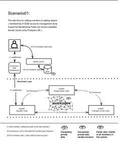
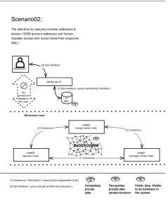
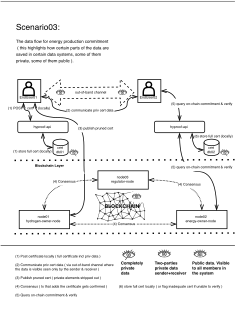
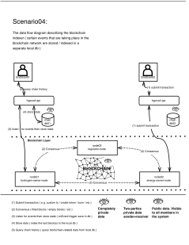

# HyProof Data Flow Diagrams

Scenario 01:

**[Edit diagram ( for access, contact the creator of it )](https://drive.google.com/file/d/1N8DVCKQ6QLvXSVZmP3AYWeV3JFL91gSg/view?usp=drive_link)**

---

Scenario 02:

**[Edit diagram ( for access, contact the creator of it )](https://drive.google.com/file/d/1yBkkYu3GqBoft31-__SduT21bQ17oc15/view?usp=drive_link)**

---

Scenario 03:

**[Edit diagram ( for access, contact the creator of it )](https://drive.google.com/file/d/1xtS4HNdLFhNp08JAAH0sCEGc8cuHtfHy/view?usp=drive_link)**

---

Scenario 04:

**[Edit diagram ( for access, contact the creator of it )](https://drive.google.com/file/d/14j2XawXJ70CxSHz6jEkZ-95AhUjTc4c1/view?usp=drive_link)**

---
