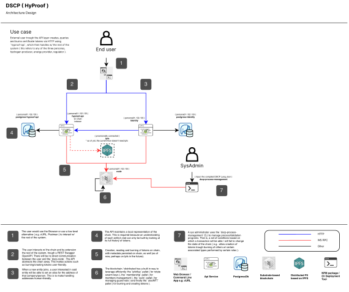

# HyProof

## HyProof: Overview

**HyProof**, aka **Hydrogen Proof** is the effort to deliver the DLT-based _MVP_ as part of the wider **HII Seed** initiative. _HII Seed_ aims to push the boundaries when it comes to building the socio-technical acceptability and business implications of a fully digitised UK certification infrastructure for verifiable hydrogen provenance ( green hydrogen to be more exact ), and develop an MVP-grade demonstration of the same.

While the scope of the overall _HII Seed_ initiative is broader, i.e., "to build a workable trust and verification framework for the provenance and quality of Hydrogen used domestically or destined for export", the objective of this specific endeavour is to  **deliver an MVP** to demonstrate the key technological and functional capabilities of the **Certification Process** in the production management of Hydrogen.

The MVP focusses on the key business flows (and the underlying technical components to deliver them). They are:

1. A producer reporting into the system the details of the batch of hydrogen they produced
2. The energy producer asserting the carbon embodiment contained in the production of that hydrogen batch
3. A hydrogen certificate being issued with the details from the above actions
4. Authorised viewers being able to view the certificate

For this proof of concept it has been decided that the consensus layer will be constructed using our in-house build **[DSCP](https://github.com/digicatapult/dscp-documentation)** ( **D**istributed-**S**upply-**C**hain-**P**latform ). However, this layer will not include the vanilla default version of DSCP but a special flavor of this platform that uses a purposely-build custom process flow.

---

## HyProof: Process Flows

The token model or better said, the the definition of the two token types plus flow restriction functions for this project can be found with proper explanations in the first MD file found in same folder where this document is located:

* **[token-flows.md](./token-flows.md)**

The token model is also available in our Domain Specific Language ( .DSCP ) and can be found in **`dscp-hyproof-api`** repository, more exactly in **[processFlows.dscp](https://github.com/digicatapult/dscp-hyproof-api/blob/main/processFlows.dscp)**.

---

## HyProof: Service Architecture Diagram

The following represents a diagram containing all the services needed to spin up this project ( basically everything needed can be found in the **`dscp-hyproof-api`** repository ). To spin-up a dscp blockchain network directly without having the client in docker, please clone the **`dscp-node`** repository.

**[Edit diagram ( for access, contact the appropriate member of the DSCP team )](https://drive.google.com/file/d/1c_Rs3Q7dpV6_jeJPyGS79qvC6MIoe20T/view?usp=drive_link)**

---

## HyProof: API Flow

For more information about the API flow, read the appropriate MD file:

* **[api-flow.md](./api-flow.md)**

---

## HyProof: Birds Eye Overview

To better understand this project from a high-level bird's eye point of view, read the appropriate MD file:

* **[high-level-overview.md](./high-level-overview.md)**

---

## HyProof: Data Flow

TBD

---

## HyProof: Architecture Diagram

To understand the system architecture used in this project especially the technology stack, read the appropriate MD file:

* **[architecture-diagram.md](./architecture-diagram.md)**

---

## HyProof: Glossary of Terms

This section describes some terminology used in the HyProof project.

| Term                   	| Definition                                                                                                                                                                                                                                                                                                                                                                                                                                                                                              	|
|------------------------	|---------------------------------------------------------------------------------------------------------------------------------------------------------------------------------------------------------------------------------------------------------------------------------------------------------------------------------------------------------------------------------------------------------------------------------------------------------------------------------------------------------	|
| Certificate Initiation 	| The initial step in the certificate issuance process, where the hydrogen producer submits a request for a digital certificate.  Here the certificate has been requested, and is a pending state therefore “initiating”. There had been no validation / verification from the system nor regulator nor energy producer has not filled details about the source of energy mix that was used to produce the batch of hydrogen.                                                                          	|
| Certificate Issuance   	| The process of generating and issuing a digital hydrogen certificate, including data validation, unique identifier generation, carbon intensity calculation.                                                                                                                                                                                                                                                                                                                                            	|
| Certificate Viewing    	| The ability to access and view the details of a digital hydrogen certificate, including batch information, energy usage data, certificate identifier, carbon intensity, hydrogen token value, and certificate status. Different roles may view different versions of the same certificate (such as Emma the Energy Producer, Heidi the Hydrogen Producer, Reginald the Regulator, Connor the Hydrogen Consumer may all see different versions of certificate i.e. may display different information) 	|
| Certificate Revocation 	| The authorised action of invalidating ”revoking” digital hydrogen certificate, typically due to non-compliance, errors, or fraudulent activities. In the case, it will be the regulator who has the authorisation to revoke a certificate.                                                                                                                                                                                                                                                           	|
| Cancellation           	| Cancellation of the submission of the certificate initiation process by Heidi the hydrogen producer.                                                                                                                                                                                                                                                                                                                                                                                                    	|
| Certificate Status     	| The current state of a digital hydrogen certificate, indicating whether it is INITIATED, ISSUED, or REVOKED.                                                                                                                                                                                                                                                                                                                                                                                            	|
| Carbon Embodiment      	| The carbon footprint associated with the production of a batch of hydrogen, considering the energy consumption and carbon emission factors of the energy sources used.                                                                                                                                                                                                                                                                                                                                  	|
| Certificate Number     	| A distinctive unique certificate identifier assigned to each digital hydrogen certificate to ensure its uniqueness and facilitate tracking.                                                                                                                                                                                                                                                                                                                                                             	|
| Hydrogen Token         	| A digital asset representing the value of a unit of hydrogen, derived from the quantity of hydrogen produced and the carbon intensity of its production.                                                                                                                                                                                                                                                                                                                                                	|
| HyProof System         	| The system that manages the issuance and viewing of digital certificates, and in this case, hydrogen certifications.                                                                                                                                                                                                                                                                                                                                                                                    	|
| Hydrogen Producer      	| Entity that produces and sells hydrogen, responsible for initiating the certificate issuance process. “Heidi”                                                                                                                                                                                                                                                                                                                                                                                           	|
| Energy Producer        	| Entity that generates and supplies energy for hydrogen production, responsible for providing carbon embodiment data. “Emma”                                                                                                                                                                                                                                                                                                                                                                             	|
| Regulator              	| The governing body responsible for overseeing the hydrogen certification process and ensuring compliance with standards. May also have the authorisation to revoke digital hydrogen certificates in specific cases “Reginald”                                                                                                                                                                                                                                                                           	|
| Hydrogen Consumer      	| Entity that has purchased / would like to purchase hydrogen from the Hydrogen Producer, therefore would like to see the validity of the hydrogen digital certification. “Connor“                                                                                                                                                                                                                                                                                                                        	|

---

