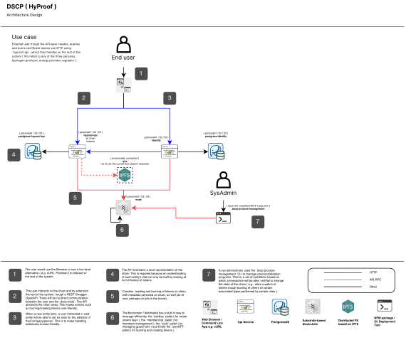

# HyProof Service Architecture Diagram

The following represents a diagram containing all the services needed to spin up this project ( basically everything needed can be found in the **`sqnc-hyproof-api`** repository ). To spin-up a sqnc blockchain network directly without having the client in docker, please clone the **`sqnc-node`** repository.

**[Edit diagram ( for access, contact the appropriate member of the Sequence (SQNC) team )](https://drive.google.com/file/d/1c_Rs3Q7dpV6_jeJPyGS79qvC6MIoe20T/view?usp=drive_link)**

---
