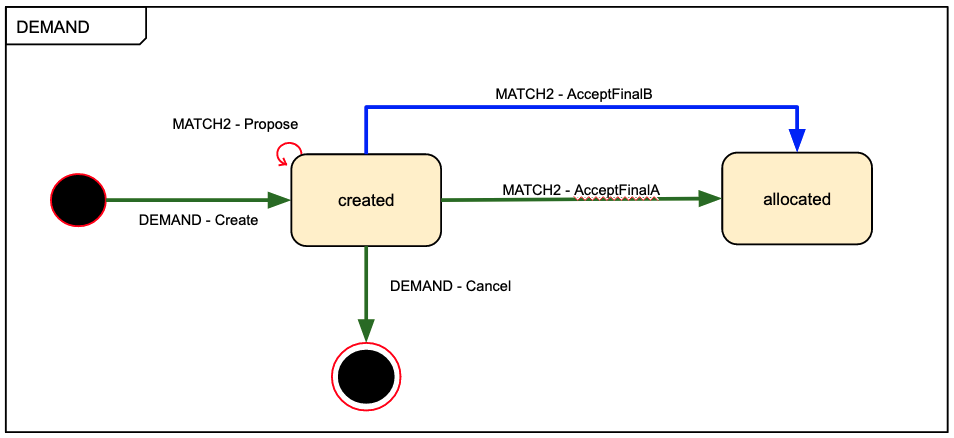
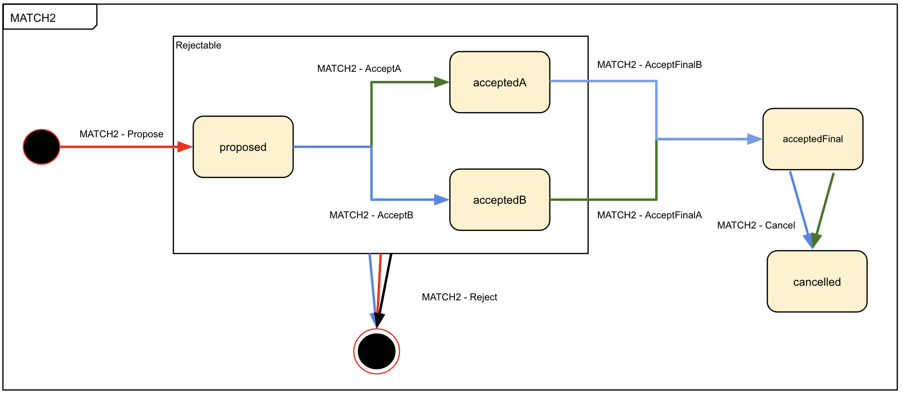
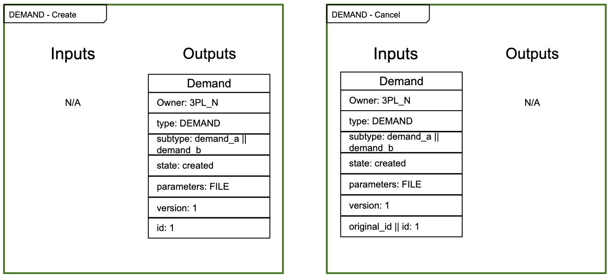
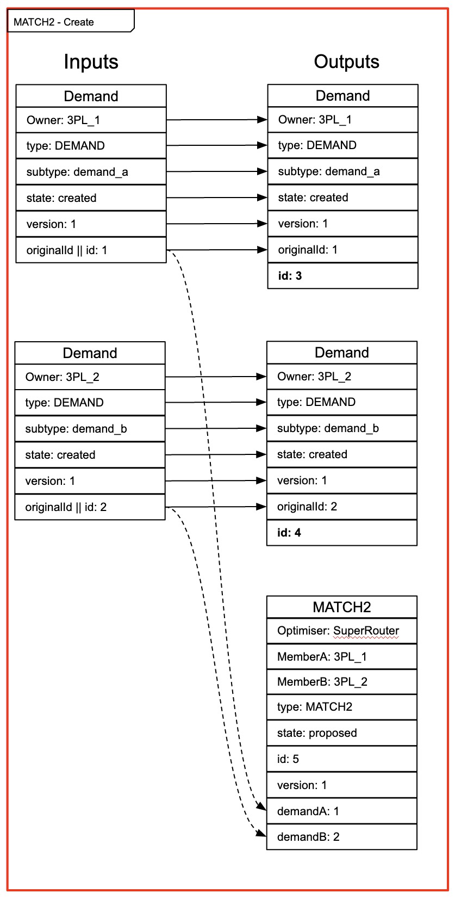
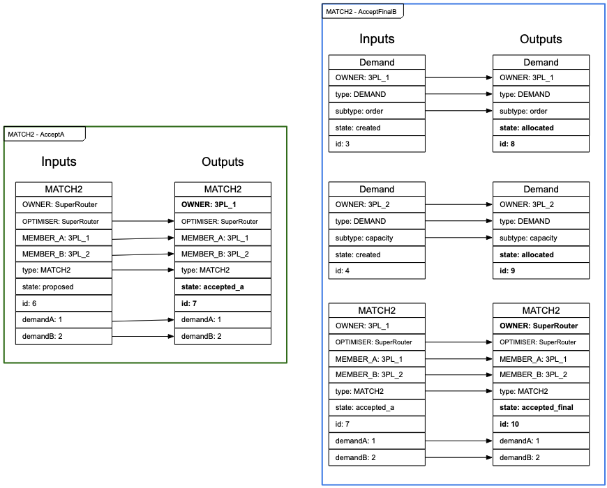
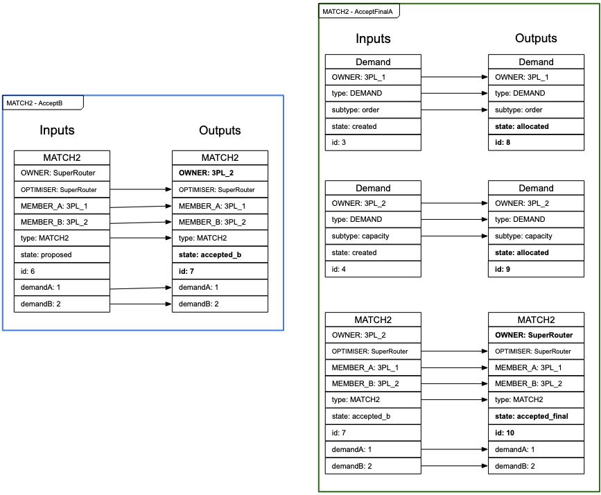
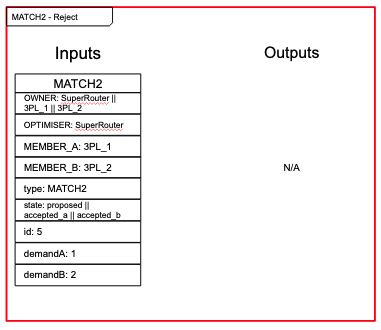

# Token Model Example

[Full example](https://docs.google.com/drawings/d/1A7XaDMwlpOjIGasTgv61KOS0sE9tFrBO5sXeuKMN5ag/edit)

## Roles

MEMBER_A

MEMBER_B

OPTIMISER

## Token types

Represents either a member's order or a member's capacity.

Represents the proposal and allocation of one member's order to a different member's capacity.

## Transactions

### Demand

Created by a member.

### Match2

An optimiser proposes the matching of a single order from some `MEMBER_A` to a single capacity of a different `MEMBER_B`.

Accept flow if `MEMBER_A` accepts first, then `MEMBER_B`.

Accept flow if `MEMBER_B` accepts first, then `MEMBER_A`.

A match can be rejected by any party before it is fully accepted.

