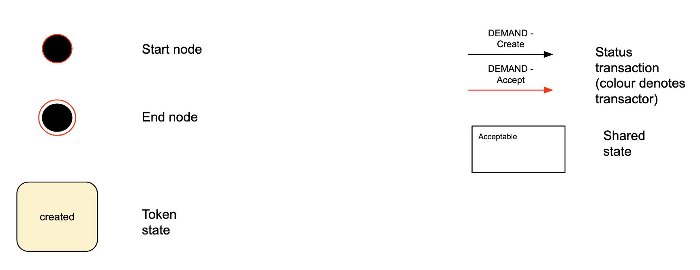
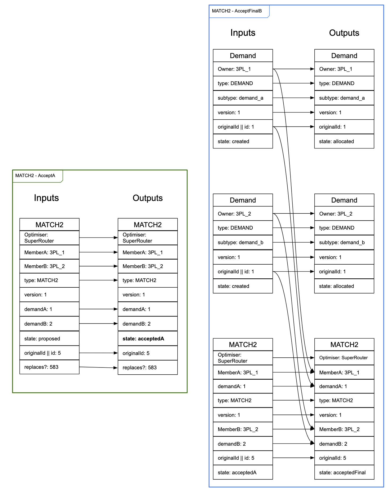
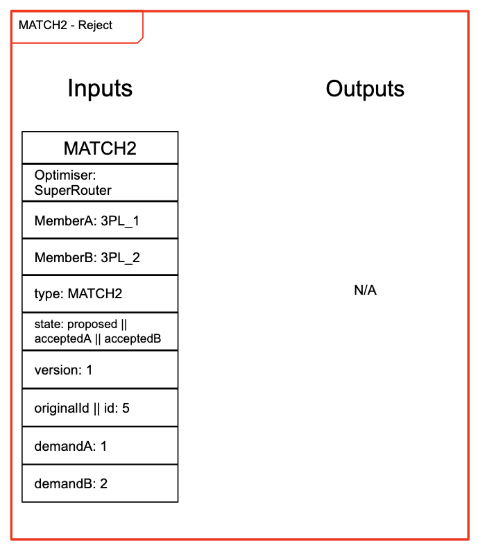
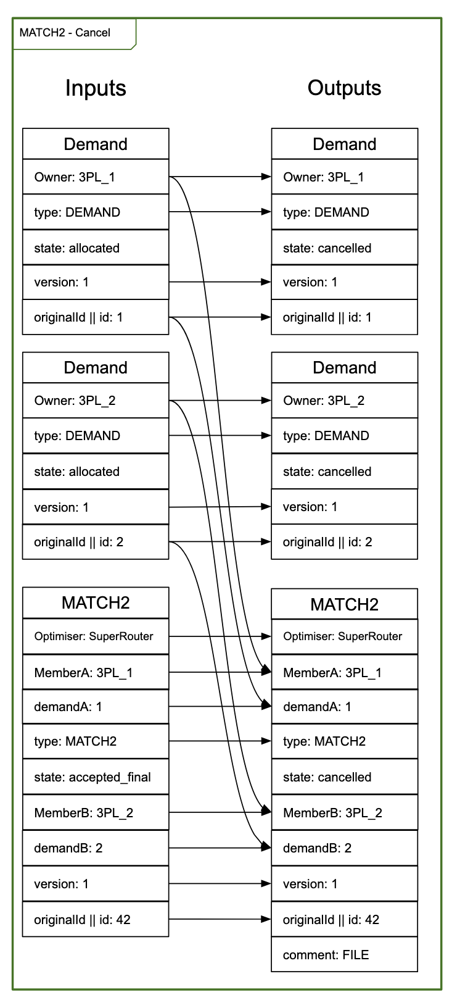

# Token Model Example

[Full example](https://docs.google.com/drawings/d/1A7XaDMwlpOjIGasTgv61KOS0sE9tFrBO5sXeuKMN5ag/edit)

## Key

## Roles

 <b>MemberA</b>

 <b>MemberB</b>

 <b>Optimiser</b>

## Token types

An abstract representation of a demand which must be matched with another demand of a different type. For example in L3 this represents either a member's order or a member's capacity.

An abstract representation of a match between two different kinds of demand. In L3 this represents the proposal and allocation of one member's order to a different member's capacity.

## States

| Token    | State           | Represents                                                                                                                                                                                                                                                                                  |
| -------- | --------------- | ------------------------------------------------------------------------------------------------------------------------------------------------------------------------------------------------------------------------------------------------------------------------------------------- |
| `DEMAND` | `created`       | A `DemandA`/`DemandB` (e.g. order/capacity in L3) that a member has made available to be matched. If the demand is no longer required, the token can be burned.                                                                                                                             |
|          | `allocated`     | A `DemandA`/`DemandB` (e.g. order/capacity in L3) that's allocated to a corresponding `DemandB`/`DemandA` in a `MATCH`. Allocation can be cancelled, but the token can no longer be burned.                                                                                                 |
|          | `cancelled`     | A `DemandA`/`DemandB` that's been allocated can move to a cancelled state. Note: if either member requests a cancellation - both members (`DemandA`&`DemandB`) move to cancelled state as well as their corresponding `MATCH2`.                                                             |
| `MATCH2` | `proposed`      | A proposed pairing of a `DemandA` (e.g. an order in L3) and a `DemandB` (e.g. a capacity in L3). The first accept of a `proposed` `MATCH2` can be made by either member. `DemandA` and `DemandB` must come from different members. Only references the demands, doesn't change their state. |
|          | `acceptedA`     | A proposed `MATCH2` that has been accepted by the owner of `DemandA`. Still only references the demands, doesn't change their state.                                                                                                                                                        |
|          | `acceptedB`     | A proposed `MATCH2` that has been accepted by the owner of `DemandB`. Still only references the demands, doesn't change their state.                                                                                                                                                        |
|          | `acceptedFinal` | A proposed `MATCH2` that has been accepted by both members. At this point the demands change state to `allocated`.                                                                                                                                                                          |
|          | `cancelled`     | Upon cancel request from either `MemberA`/`MemberB` both members (`DemandA`&`DemandB`) move to cancelled state as well as their corresponding accepted `MATCH2`.                                                                                                                            |

## Transactions

### Demand

Created by a member.

Commented on by any member

### Match2

An `Optimiser` proposes the matching of a single `DemandA` from some `MemberA` to a single `DemandB` of a different `MemberB`.

Accept flow if `MemberA` accepts first, then `MemberB`.

Accept flow if `MemberB` accepts first, then `MemberA`.

A match can be rejected by any party before it is fully accepted.

A match can be cancelled by either `MemberA` or `MemberB` after it has been fully accepted.

