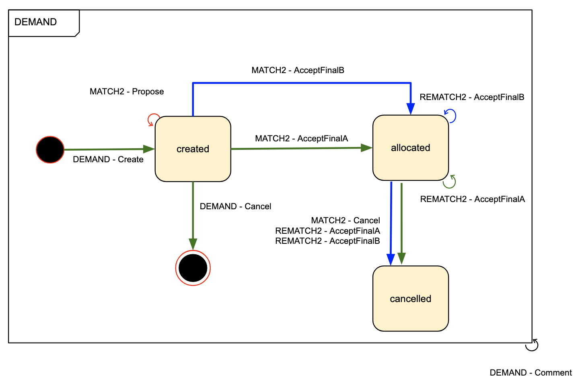
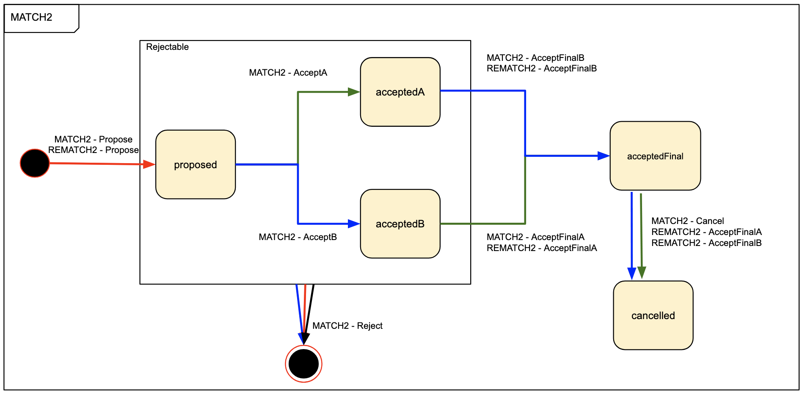

# Token Model Example

[Full example](https://docs.google.com/drawings/d/1A7XaDMwlpOjIGasTgv61KOS0sE9tFrBO5sXeuKMN5ag/edit)

## Key

## Roles

 <b>MEMBER_A</b>

 <b>MEMBER_B</b>

 <b>OPTIMISER</b>

## Token types

Represents either a member's order or a member's capacity.

Represents the proposal and allocation of one member's order to a different member's capacity.

## States

| Token    | State            | Represents                                                                                                                                                                                                                                                                                                                                                                                         |
| -------- | ---------------- | -------------------------------------------------------------------------------------------------------------------------------------------------------------------------------------------------------------------------------------------------------------------------------------------------------------------------------------------------------------------------------------------------- |
| `DEMAND` | `created`        | An order/capacity that a member has made available to be matched. If the demand is no longer required, the token can be burned.                                                                                                                                                                                                                                                                    |
|          | `allocated`      | An order/capacity that's allocated to a corresponding capacity/order in a `MATCH`. Allocation can't be cancelled, the token can no longer be burned.                                                                                                                                                                                                                                               |
| `MATCH2` | `proposed`       | A proposed pairing of an order (`DemandA`) and a capacity (`DemandB`). `DemandA` could be an order `DEMAND` and `DemandB` a capacity, as long as there's one of each, not two orders or two capacities. The first accept of a `proposed` `MATCH2` can be made by either member. `DemandA` and `DemandB` must come from different members. Only references the demands, doesn't change their state. |
|          | `accepted_a`     | A proposed `MATCH2` that has been accepted by the owner of `DemandA`. Still only references the demands, doesn't change their state.                                                                                                                                                                                                                                                               |
|          | `accepted_b`     | A proposed `MATCH2` that has been accepted by the owner of `DemandB`. Still only references the demands, doesn't change their state.                                                                                                                                                                                                                                                               |
|          | `accepted_final` | A proposed `MATCH2` that has been accepted by both members. At this point the demands change state to `allocated`.                                                                                                                                                                                                                                                                                 |

## Transactions

### Demand

Created by a member.

### Match2

An optimiser proposes the matching of a single order from some `MEMBER_A` to a single capacity of a different `MEMBER_B`.

Accept flow if `MEMBER_A` accepts first, then `MEMBER_B`.

Accept flow if `MEMBER_B` accepts first, then `MEMBER_A`.

A match can be rejected by any party before it is fully accepted.

