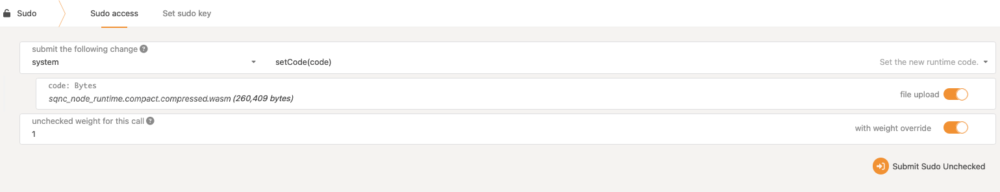
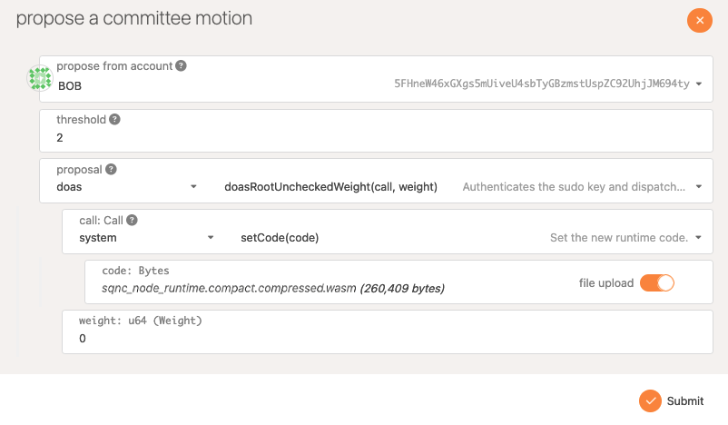

# Runtime Upgrade

One of Substrate's main features is its support for runtime chain upgrades without forking the code base. Compared to other blockchain frameworks, Substrate makes it easy to add new features to the logic that defines how a chain runs. This is possible because the runtime definition is part of the chain state, meaning it can be validated and set through a chain's usual consensus mechanisms.

This page describes how to upgrade the runtime when using `veritable-node`.

## Prerequisites

A local checkout of [veritable-node](https://github.com/digicatapult/dscp-node) that is successfully running and creating blocks.

## Compile upgrade

In a terminal window separate from the currently running `veritable-node`, checkout a branch of a newer runtime that includes any desired changes. For the upgrade to work, `spec_version` in [`runtime/src/lib.rs`](https://github.com/digicatapult/dscp-node/blob/main/runtime/src/lib.rs-node) must be set to a higher number than the current runtime. The current runtime version is also visible in the top-left of [Polkadot Substrate Portal](https://polkadot.js.org/apps/).


Compile the new runtime with `cargo build --release`. The `--release` command generates a smaller build artifact for submitting to the network. Artifacts are generated in `target/release/wbuild/dscp-node-runtime`:

```
dscp_node_runtime.compact.compressed.wasm
dscp_node_runtime.compact.wasm
dscp_node_runtime.wasm
```

## Submit upgrade

The compiled `wasm` artifact containing the runtime logic can be submitted to the running chain either as an admin user, using Substrate's [`sudo`](https://docs.rs/pallet-sudo/latest/pallet_sudo) pallet, or through a vote, using a custom `veritable` pallet called `doas` alongside Substrate's [`collective`](https://docs.rs/pallet-sudo/latest/pallet_collective) pallet.

### Sudo

If a chain has an agreed administrator account, that account can be used to upgrade the runtime with `sudo`. This example uses the default `Alice` account that's part of the membership of `veritable-node` when run in `dev` mode.

1. Open [Polkadot Substrate Portal](https://polkadot.js.org/apps/) in a browser and connect to the local node.
2. Go to `Developer` -> `Sudo`.
3. Set the call to `system` and `setCode(code)`.
4. Click `file upload` and upload `dscp_node_runtime.compact.compressed.wasm`.
5. Click `with weight override` and set unchecked weight to `1`.



6. Click `Submit Sudo Unchecked` then `Sign and Submit`.
7. If the transaction is successful the spec version in the top-left will have changed to match the new runtime version. The runtime is upgraded!

### Collective + Doas

Instead of requiring an administrator, the `doas` pallet may be used in conjunction with the `collective` pallet to enable `sudo`-like functionality where a majority of a chain's membership must agree to perform a `Root` call, such as a runtime upgrade.

1. Open [Polkadot Substrate Portal](https://polkadot.js.org/apps/) in a browser and connect to the local node.
2. Go to `Governance` -> `Tech. comm` -> `Proposals`. Click `Submit proposal`
3. Propose from any account e.g. `Bob`. As the transaction will be voted on, the submitter doesn't have to be an admin.
4. Keep threshold as `2`. This is the minimum number of votes required for approval.
5. Propose the `doas` pallet and the `doasRootUncheckedWeight(call, weight)` function. This is necessary to bypass weight checking that would normally cause a transaction block as large as this to fail.
6. Set the call to `system` and `setCode(code)`.
7. Click `file upload` and upload `dscp_node_runtime.compact.compressed.wasm`.
8. `Weight` can remain as `0`.



9. Click `Submit` then `Sign and Submit`.
10. Click `Vote` and submit `Vote Aye` twice, using any two accounts.
11. Now the the threshold is met, click `Close` on the proposal, then `Submit` -> `Sign and Submit`.
12. If the transaction is successful the spec version in the top-left will have changed to match the new runtime version. The runtime is upgraded!
