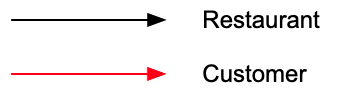
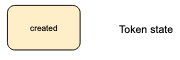
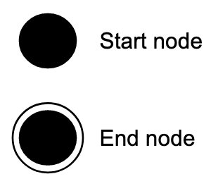
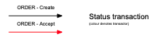
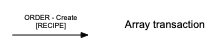
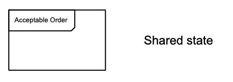

# Token Model Diagram Components

A token model is made of various components:

## Roles

A key showing which colours represent which roles.

## States

Tokens always have a state. Every transaction has a fixed output state.

### Start of life/end of life

The start and end point for a token type, effectively the `null` state.

## Transactions

The colour of a transaction arrow indicates which role will run the transaction.

//TODO How to display transactions that can be run by more than one role

### Status transaction

A transaction moving a single token from one state to another.

A transaction that appends/removes related tokens to a token. State is unchanged.

## Shared (hierarchical) states

Groups tokens with different states that can be treated as the same state in a subsequent transaction e.g. both a `created` and a `rejected` order is `editable` and can be the input of an `ORDER - append` transaction.

