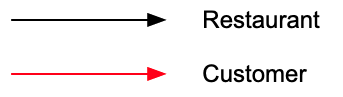
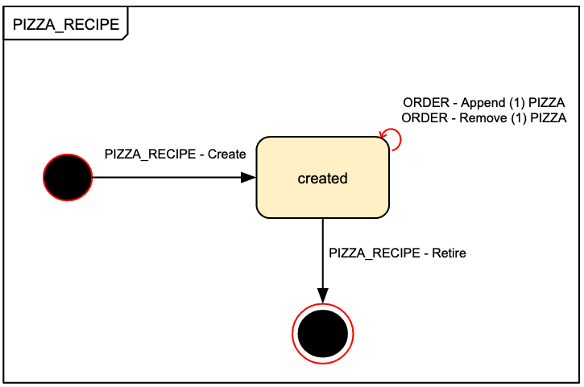

# Token Model Example

[Full example](https://docs.google.com/drawings/d/1PEFb19NgPAOEN-r-pZYUeSWODXd8TMp7SFHr8QLez-8/edit)

## Real world story

This example will look at the simplified process of a customers orders of pizzas from restaurants. A token model is only as good as the real world narrative it's based on. An example of the level of detail required about a process before a token model can be made:

- There are two parties involved: customer and restaurant.
- There is a menu of pizzas, defined by the restaurant.
- An order can contain any number of pizzas.
- Orders can be rejected by the restaurant, after which the customer can edit the order.
- Orders can be cancelled, but only the restaurant can cancel once the order is submitted.

## Building a token model

### Roles

Roles are consistent across all token types so must be defined first. Part of guard railing transactions is defining which roles can run which transactions. Here there are two types of role, `Customer` and `Restaurant`. `Restaurant` transactions are keyed as `black` and `Customer` as `red`.

### First token type

A restaurant sets a menu of pizzas - a token type of `PIZZA` with an initial `PIZZA - create` transaction run by a `Restaurant` (note black arrow). This mints a `PIZZA` token in the `created` state. For now, other metadata (e.g. `name`, `toppings`) about the pizza isn't important.

### Second token type

Now there are pizzas, a customer can make an order. As an order references an array of pizzas, modelling is more challenging. The first step is keep it simple and define a blank order (0 pizzas). This is very similar to creating a pizza, but the transaction is run by a customer.

The blank `created` order is a staging state for a customer to build up an order of pizzas before sending the order to a restaurant with `ORDER - submit`.

### Handling arrays

Next add transactions to append and remove pizzas from an order - one at a time. These transactions don't change the state of any tokens and can be run as many times as required.

If orders of > 10 pizzas were regularly expected, additional transactions could be added such as `ORDER - Append (10) PIZZA`.

### Shared (hierarchical) states

Orders can be rejected by a restaurant.

Once rejected a customer can then edit (append/remove pizzas) and resubmit the order. Since the transactions are the same as can be run on `created`, the states can be grouped together into `Editable Order`.

Alternatively, it could be argued that having separate `created` and `rejected` states is redundant. They both have the same outgoing transactions so could be combined.

The best approach depends on the use case and domain knowledge. Perhaps it is important to track the number of `rejected` orders.

### End state

Finally, tokens need an end state so they can be 'retired'. A pizza can only be retired by the restaurant that designed it.

An order can be retired by either a customer or a restaurant, depending on its state.

