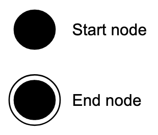
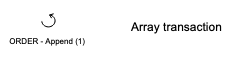
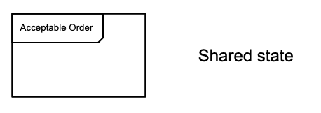

# Components

For now the model is generated using [Google Drawing](https://docs.google.com/drawings/d/1PEFb19NgPAOEN-r-pZYUeSWODXd8TMp7SFHr8QLez-8/edit).

A token model is made of various components:

## Start of life/end of life

## States

Every transaction has a fixed output state.

## Transactions

A transaction moving a single token from one state to another.

A transaction moving a single token from one state to another, as well as array(s) of related tokens.

## Shared (hierarchical) states

Used to group tokens with different states that can be treated as the same state in a subsequent transaction e.g. both a `submitted` and a `amended` order is `acceptable` and can be the input of an `ORDER - accept` transaction.

